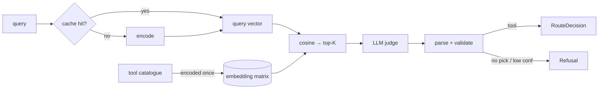

# agent-tool-router — pick the right tool, or refuse with a typed reason

[](https://github.com/darrshangovender/agent-tool-router/actions/workflows/tests.yml)
[](LICENSE)
[](https://python.org)
[](https://docs.pydantic.dev)

> Given a user query and a catalogue of tools, a two-stage router picks one — an embedding prefilter shortlists candidates, then a small LLM judge returns a Pydantic-validated decision. Refusal is a first-class outcome with four named reasons, not a fallback.

**Why this exists.** Every agent framework hand-waves tool selection, and it is where most agent failures originate: picking the wrong tool, hallucinating arguments, or calling a tool when the model should have declined. Splitting the decision in two means a cheap local embedding pass does the recall work and an expensive model only ever sees three candidates. No agent loop, no memory — just the routing decision, done carefully.

---

## Quick start

```bash
pip install -e ".[dev]"                 # adds sentence-transformers, pytest, ruff
python examples/customer_support_bot.py # 8 tools, 20 queries, no API key needed
```

```python
from agent_tool_router import Router, Tool
from agent_tool_router.embedding_prefilter import make_encoder
from agent_tool_router.llm_judge import LLMJudge, AnthropicBackend

tools = [
    Tool(name="issue_refund", description="Issue a refund for a specific order.",
         args_schema={"order_id": "string"}, tags=["money", "refund"]),
    Tool(name="kb_search", description="Search the internal knowledge base.", tags=["search"]),
    Tool(name="escalate_to_human", description="Hand off to a live human agent."),
]

router = Router(
    tools,
    encoder=make_encoder("sentence-transformers"),   # or "openai" / "stub"
    judge=LLMJudge(AnthropicBackend(model="claude-haiku-4-5")),
    top_k=3,
    confidence_threshold=0.5,
)

d = router.route("I want my money back for order 9921")
if d.is_route:
    print(d.tool, d.confidence, d.latency_ms)
else:
    print(d.refusal.reason.value, d.refusal.message, d.refusal.candidates)
```

## How it works



1. At construction, every tool's `name — description — tags` is encoded into one matrix.
2. A query is looked up in the embedding cache by `sha256(model::query)`, or encoded.
3. `matrix @ qvec` gives cosine scores; a stable argsort takes the top **K** candidates (default 3).
4. The judge prompt carries the query plus each candidate's name, description and score.
5. The response is regex-extracted to JSON, parsed, and validated against `JudgeDecision`. Malformed output — or a tool outside the candidate set — becomes a `low_confidence` refusal rather than an exception.
6. A pick below `confidence_threshold` is also converted to `low_confidence`.
7. You get a `RouteDecision` carrying the tool or the refusal, plus confidence, reasoning, candidates and latency.

## The four refusal reasons

| Reason | Fires when | What a human should do |
|---|---|---|
| `no_matching_tool` | The shortlist genuinely doesn't solve the query | Add a tool, or confirm the request is out of product scope |
| `ambiguous_match` | Two or more candidates are equally plausible | Sharpen the overlapping tool descriptions |
| `low_confidence` | The pick fell below threshold, or the judge output failed validation | Check the judge model and the prompt; this is also the parse-failure bucket |
| `out_of_scope` | A policy-blocked capability was requested | Nothing — this is the system working |

The router never silently picks the closest tool. Making refusal typed is what turns "the agent did something odd" into a reviewable queue with four buckets.

## Design decisions

| Decision | Why |
|---|---|
| **Embeddings first, LLM second** | Recall is cheap and local; judgement is expensive and remote. Sending 50 tool descriptions to a model on every turn is the naive design and it dominates cost at any real traffic level. |
| **Refusal is a return value, not an exception** | An exception forces the caller into try/except around a *normal* outcome. A typed refusal can be logged, counted, and triaged. |
| **Judge output is Pydantic-validated** | JSON mode still returns malformed output. Validating at the boundary means a bad response degrades to a refusal instead of propagating a half-parsed dict. |
| **Three encoder backends including a stub** | The suite and the examples run with no model download and no key, which is what makes the repo actually runnable by a reviewer. |
| **Judge backends are lazily imported** | `import agent_tool_router` never requires the Anthropic or OpenAI SDK. |

## Limitations

- **The published accuracy table has been removed from this README.** The previous version cited routing accuracy, refusal precision/recall, latency and cost per 1k routes across four configurations. None of it is traceable: `benchmarks/run.py` writes a `results.json` that is not committed, the API-backed rows cannot be reproduced without keys and billing, and the dollar figures were hardcoded constants in the harness, not measurements. Run `python benchmarks/run.py` against the committed 50-case corpus to generate your own.
- **The prefilter is a full O(N·D) matmul and a full argsort on every query.** There is no ANN index. Fine at ten tools; the ceiling is unstated because it has not been measured.
- **`top_k` is a hard recall ceiling the taxonomy cannot express.** If the correct tool ranks fourth, the judge never sees it and the outcome is `no_matching_tool` — indistinguishable, to a reviewer, from a catalogue that genuinely lacks the tool.
- **The embedding cache is exact-string keyed**, so the templated queries its own docstring cites (`show order #9921`, `show order #9922`) both miss. It is also unbounded, has no TTL, eagerly loads the whole SQLite table into RAM at construction, and opens a fresh connection per write.
- **No retry, timeout, or rate-limit handling on either real backend.** A 429 propagates out of `route()` as an exception — the refusal taxonomy never sees it, which is exactly backwards for a component whose selling point is graceful degradation.
- **`Tool.args_schema` is collected and never used.** The judge prompt carries only name, score and description — so argument applicability, which is the stated reason a judge is needed at all, is not information the judge has.
- **`StubEncoder` uses builtin `hash()`**, which Python randomises per process. It is deterministic within a run, not across runs, unless `PYTHONHASHSEED` is set.

## Project layout

```
agent-tool-router/
├── agent_tool_router/
│   ├── router.py               # two-stage orchestration + threshold
│   ├── embedding_prefilter.py  # stage 1 — MiniLM · OpenAI · stub encoders
│   ├── llm_judge.py            # stage 2 — Anthropic · OpenAI · Echo backends
│   ├── refusal.py              # the four reasons + structured Refusal
│   └── cache.py                # in-memory + SQLite query-embedding cache
├── benchmarks/                 # run.py + 50-case routing corpus (32 routes, 18 refusals)
├── examples/                   # customer_support_bot (8 tools) · dev_assistant (10 tools)
├── tests/                      # 31 tests, no API key, no model download
└── docs/                       # architecture · prompt-design
```

## Tests

```bash
make test        # 31 tests, offline
make bench       # regenerate the routing benchmark against the committed corpus
```

CI runs the suite on every push.

## Author

Darrshan Govender · [Agulhas Code](https://agulhascode.co.za) · Durban, South Africa
